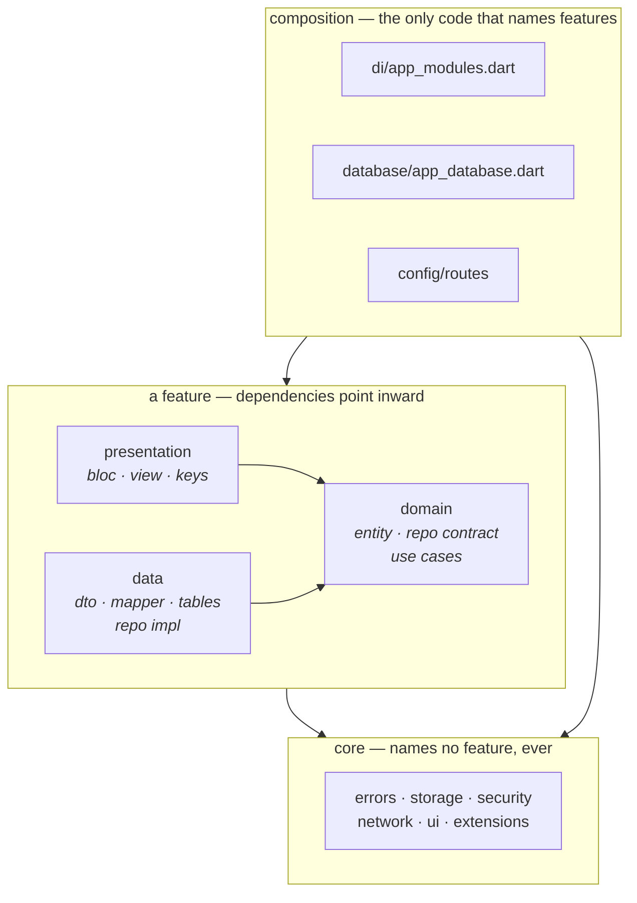

<div align="center">

# 🐕 Flutter Clean Architecture Boilerplate

**A production-shaped Flutter starter you rename in one command and ship from.**

Clean architecture that the import graph actually enforces · security wired in from the first commit · every workflow behind one `make` target.

<br/>

[](https://flutter.dev)
[](https://dart.dev)
[](#-requirements)
[](LICENSE)


<br/>

<a href="https://github.com/zeref278"></a>
<a href="https://github.com/zeref278/flutter_boilerplate"></a>

<br/><br/>

<a href="https://www.buymeacoffee.com/zeref278" target="_blank"></a>

</div>

---

## ⚡ Sixty seconds to your own app

```sh
git clone <this repo> my_app && cd my_app
make rename NAME=my_app ORG=com.acme DISPLAY="My App"
make setup
make run_dev
```

That is the whole onboarding. `make rename` rewrites the package name across
every Dart import, the Android namespace, application id and Kotlin package,
and the flavor config, then regenerates the native scaffolding — the thing
that otherwise costs you an afternoon of find-and-replace across 76 files.

> **Run it on a clean checkout.** It is the one step that is hard to undo.

---

## ✨ What you actually get

| | |
|---|---|
| 🧱 **Clean architecture, enforced** | `core` names **zero** features. Deleting the bundled example touches three composition files and nothing else. |
| 🔐 **Security from commit one** | Compiled-in config, obfuscated secrets, keychain + AES-256 storage, RASP, signed releases, flavor-mismatch guard. |
| 🎛️ **Flavors that cannot desync** | A binary built as one flavor but compiled with another's config refuses to launch. |
| 🧩 **One barrel import** | Features import `package:<app>/core/core.dart`. Curated, not `export everything`. |
| 🧪 **Tests that mean it** | Unit + widget + on-device integration, merged into one LCOV trace behind an 80% gate. |
| 🌍 **First-party i18n** | `gen_l10n` with a `context.l10n` extension. No third-party localization dependency. |
| 🗄️ **Two storage roles** | Credentials to the platform keychain, everything else AES-256 — routed by the key, never by the caller. |
| 🌐 **Hardened transport** | Anti-proxy client, SPKI pinning, optional certificate pinning. Misconfiguring them fails at startup, not silently. |
| 🔑 **Auth + logging interceptors** | Single-flight token refresh with one retry. Logs that redact credentials instead of printing them. |
| 🚦 **Typed failures** | `Either<Failure, T>` end to end, one `guard` boundary, localized messages. |
| 🛠️ **Everything is `make`** | `rename` · `setup` · `run_dev` · `build_apk_production` · `analyze` · `test` · `coverage` |

---

## 📱 Screenshots

> The bundled demo is a two-surface dog-image feature — random and saved —
> exercising the network stack, the database, notifications, and a destructive
> confirm dialog. Drop your captures in here once you have made it yours.

| Intro | Random | Saved | Blocked |
|:---:|:---:|:---:|:---:|
| _add capture_ | _add capture_ | _add capture_ | _add capture_ |

---

## 🧭 How it fits together



**The invariant:** `grep -ri dog_image lib/core` returns nothing. Keep it that
way and any feature stays deletable.

---

## 🔒 Security, concretely

| Concern | How it is handled |
|---|---|
| **Config leakage** | `envied` compiles one `.env` into the binary. Nothing readable in the bundle, nothing loaded at runtime, no other environment's values present. |
| **Secrets at rest** | `obfuscate: true` XOR-scrambles values in `libapp.so`. Raises extraction cost — not encryption, and documented as such. |
| **Credentials** | Routed to the platform keychain by key membership, never by the caller. Everything else lands in an AES-256 Hive box. |
| **Wrong-flavor builds** | `AppConfig.verifyFlavor()` throws when the built flavor and the baked config disagree. Fails at launch, not at upload. |
| **Tampered runtime** | RASP checks root/jailbreak, hooking, emulator, debugger, resigning, cloning, ID spoofing, TLS interception. Armed in production only. |
| **Release signing** | Read from a gitignored `key.properties`. Absent means debug-key fallback, announced on every build. |
| **Proxy sniffing** | The HTTP client is forced past the system proxy, so Charles, Proxyman, and Burp see nothing even on a device the operator controls. |
| **MITM** | SPKI pinning validates the server's public key during the handshake already happening. Optional whole-certificate pinning on top. |
| **Credential leakage in logs** | Credential headers and query parameters are redacted by name; bodies are not logged unless you opt in, because a payload key could be anything. A token in scrollback outlives the request by weeks. |
| **Session handling** | Tokens attached from the keychain, renewed once on 401 behind a single-flight guard, cleared on failure. |
| **Transport** | Explicit Dio timeouts — the defaults are unbounded, which turns a dead network into a hung UI. |

Two failure modes are handled deliberately rather than dogmatically:

- A RASP **internal error** is recorded and ignored. Blocking on it would let
  a bug in the checks brick every install — worse than the tampering it hunts.
- An **empty signature list** disables the signature comparison rather than
  failing every build. Fill `VALID_ANDROID_SIGNATURES` before shipping.

> **No crash backend is wired.** `LogCrashlyticsService` forwards to the
> logger, and the logger's default filter drops everything in a release
> build. So "recorded and ignored" above means *recorded in debug*: in a
> production release those RASP internal errors, the engine's own
> exceptions, and anything reaching `bootstrap`'s zone handler go nowhere.
> The boundary exists so you only swap one class — register a
> Firebase-backed `CrashlyticsService` in `CoreModule` — but until you do,
> treat every "we record it and keep going" tradeoff on this page as a
> debug-build promise only.

---

## 📋 Requirements

- Flutter `3.44.9` or newer, plus Android Studio or Xcode for platform builds
- **Nothing else**

FVM is **optional**. Every `make` target uses `fvm` when installed and plain
`flutter` when not — no flag, no config. `.fvmrc` records the version this
project is developed against, for anyone who wants the pin. `pubspec.yaml`
states its SDK range, so a too-old toolchain fails at `pub get` naming the
version rather than somewhere confusing later.

```sh
make test FLUTTER=/path/to/flutter DART=/path/to/dart   # force a toolchain
```

---

## 🚀 Making it yours

After `make rename`:

1. **Strip the example.** Delete `lib/features/dog_image/`, its tests, its
   robots, and its `dogImage*` keys in `lib/l10n/`. Then remove its three
   references: the table in `lib/database/app_database.dart`, the module in
   `lib/di/app_modules.dart`, and the routes in
   `lib/config/routes/app_router.dart`. Nothing under `core` changes.
2. **Point it at your backend.** `BASE_URL` and timeouts in `.env.dev` and
   `.env.production`.
3. **Set up release signing.** Copy `android/key.properties.example` to
   `android/key.properties`. Until you do, release builds use the debug key
   and say so.
4. **Fill `VALID_ANDROID_SIGNATURES`** in `.env.production` with your signing
   certificate's SHA-256, colons stripped.
5. **Replace the icons.** See
   [changing a flavor's name or icon](#changing-a-flavors-name-or-icon).

---

## 🧰 Commands

```sh
make rename NAME=my_app ORG=com.acme    # make this project yours
make setup                               # deps + all code generation
make run_dev                             # bake .env.dev, then run
make build_apk_production                # bake .env.production, then build
make analyze                             # format check + static analysis
make test                                # unit and widget tests
make coverage COVERAGE_DEVICE=<ios-id>   # merged trace, 80% gate
make flavorize                           # regenerate native flavor scaffolding
```

Generated localization, Freezed, JSON, Retrofit, Drift, asset, and Mockito
files are gitignored on purpose. Run `make setup` after cloning, or
`make generate` after changing a generator input. Never commit generated code.

Device integration runs need a flavor — once product flavors exist there is no
plain `Debug` configuration left on either platform:

```sh
flutter test integration_test/cases/app_flow_test.dart -d <device-id> --flavor dev
```

`make coverage` deliberately requires an explicit iOS id and rejects other
platforms: it runs the unit/widget and iOS integration suites into separate
LCOV traces, merges them by authored file and line, and fails below 80%. It
needs macOS with Xcode, a booted iOS simulator or device, and network access
to `dog.ceo`.

---

## 📚 Reference

Everything below is the engineering detail behind the claims above.
Collapsed so the top of this file stays readable.

<details>
<summary><b>🗂️ Project structure in full</b> — <sub>the tree, the barrel, and where composition lives</sub></summary>
<br/>


Dependencies point inward within a feature:

```text
presentation -> domain <- data
```

Features import `core` through one barrel, `package:boilerplate/core/core.dart`,
so moving a file inside `core` never edits a feature. The barrel is a curated
export list rather than `export everything`: storage backends
(`EncryptedStore`, `Keychain`, `AppStorageImpl`) and composition-root wiring
(`CoreModule`, `createDio`, the log and crash services) are deliberately
absent, which keeps "application code injects only `AppStorage`" enforced by
imports instead of by convention. Nothing inside `core` imports the barrel, so
no cycle can form, and tests import by path because they reach the internals
the barrel omits.

`core` names no feature. Not one, with no exceptions — `grep -ri dog_image
lib/core` returns nothing, and that is the invariant to keep. Widget keys live
with the surface they address, feature tables live with the feature that
queries them, and `Injector` is handed its module list rather than importing
one.

The work that genuinely must know every feature is quarantined in two files
outside `core`, both of them one flat list:

| File | Names every | Adding a feature |
|---|---|---|
| `lib/di/app_modules.dart` | DI module | one line |
| `lib/database/app_database.dart` | Drift table | one entry, plus the table under the feature |

That is what makes the bundled example removable. Deleting
`lib/features/dog_image/` leaves exactly three references behind — those two
files and `config/routes/app_router.dart` — and none of them is in `core`.

```text
lib/
├── app/
│   ├── bloc/                 application state
│   ├── di/                   app registrations
│   ├── preferences/          AppPreferences boundary and stored adapter
│   └── view/                 app shell, first-screen director, block screen
├── config/
│   ├── env/                  compiled-in configuration, flavors, mismatch guard
│   └── routes/               GoRouter routes
├── core/
│   ├── core.dart             curated public surface, imported by features
│   ├── bloc/                 shared BLoC status and observer
│   ├── di/                   module contract and the module runner
│   ├── errors/               typed failures and exception mapping
│   ├── extensions/           context.l10n and Failure.displayMessage
│   ├── network/              Dio, auth tokens, and interceptors
│   ├── security/             runtime integrity contract and RASP adapter
│   ├── services/             logging and crash-reporting boundaries
│   ├── storage/
│   │   ├── app_storage.dart  app-facing key-value contract
│   │   ├── encrypted_store.dart
│   │   └── keychain.dart
│   ├── ui/                   themes and spacing scale
│   └── use_cases/            shared use-case contracts
├── database/                 Drift schema and its DI module
├── di/
│   └── app_modules.dart      the module list — the composition root
├── features/
│   ├── dog_image/
│   │   ├── data/             data sources, DTO, mappers, repository, tables
│   │   ├── di/               feature registrations
│   │   ├── domain/           entity, repository contract, use cases
│   │   └── presentation/
│   │       ├── random/       bloc, notification, view, keys
│   │       └── saved/        bloc, notification, view, widgets, keys
│   ├── home/presentation/view/
│   ├── intro/presentation/view/
│   └── setting/presentation/view/
├── l10n/                     ARB inputs, one file per locale
└── main.dart                 the only entry point

.env.dev, .env.production     configuration inputs, compiled in by envied
flavorizr.yaml                native flavor scaffolding, run by make flavorize

integration_test/
├── cases/                    end-to-end flows
└── robots/                   reusable screen robots

test/
├── unit/                     logic and persistence tests
└── widget/                   UI behavior tests
```

One feature can own several surfaces. `dog_image` has two — random and saved —
which share its entity, repository, use cases, and DI module, and split only
under `presentation/`. Each surface owns its own bloc, and a bloc owns its own
event, state, and notification.

The dog-image domain uses `DogImageEntity extends Equatable`. Drift keeps its
generated database row type separate, and the data mapper owns all conversion
between transport, database, and domain types.

</details>

<details>
<summary><b>🌍 Localization</b> — <sub>gen_l10n, context.l10n, and why ARB is one file per locale</sub></summary>
<br/>


Strings are generated by Flutter's first-party `gen_l10n`, configured in
`l10n.yaml` and run by `make generate`. There is no third-party localization
dependency.

Screens read strings through one extension rather than the generated class:

```dart
Text(context.l10n.dogImageSavedTitle)
```

`nullable-getter: false` in `l10n.yaml` makes `AppLocalizations.of(context)`
non-nullable, so `context.l10n` never needs a bang operator. The extension
lives in `core/extensions/build_context_ex.dart`; `AppLocalizations` itself is
imported only where delegates are wired.

`AppLocalizations.localizationsDelegates` already bundles the three
`GlobalMaterialLocalizations` / `GlobalWidgetsLocalizations` /
`GlobalCupertinoLocalizations` delegates, so neither the app nor a widget test
lists them by hand.

ARB is one file per locale by construction — `gen_l10n` raises
`L10nException` on a second file for the same locale, and no ARB generator
supports splitting a locale across feature files. Namespace keys by prefix
instead (`error*`, `dogImage*`); alphabetical order then groups them by
surface. A localization set large enough to need real per-feature files has
outgrown ARB rather than this layout.

Keys are namespaced by the surface that shows them — `homeTitle`,
`dogImageRandomLoadAndSave`, `settingDarkMode` — with `error*` for failure text
and `action*` for labels reused across surfaces, such as `actionLoadImage` on
both the random load button and the saved list's retry button.

</details>

<details>
<summary><b>🎛️ Flavors and configuration</b> — <sub>envied, the mismatch guard, native scaffolding, names and icons</sub></summary>
<br/>


Two flavors, `dev` and `production`. Each name appears in five places and must
match in all of them: `.env.<flavor>`, `flavorizr.yaml`, `AppFlavor`, the
`FLAVORS` list in the `Makefile`, and
`ios/Runner/Assets.xcassets/AppIcon-<flavor>.appiconset`.

Configuration is **compiled in, not loaded**. `envied` reads one `.env` file
during code generation and emits it as Dart constants, so nothing is bundled
as an asset, nothing is parsed at startup, and no build contains another
environment's values. `AppConfig` is the facade; nothing else reads `Env`.

```sh
make run_dev                # bakes .env.dev, then flutter run --flavor dev
make build_apk_production   # bakes .env.production, then builds
```

| `.env` key | What it does |
|---|---|
| `ENVIRONMENT` | `DEV` or `PROD`. Drives `AppConfig.isProduction`, which arms RASP and the release-only checks. Must match the flavor. |
| `BASE_URL` | API origin. |
| `CONNECT_TIMEOUT_MS` / `RECEIVE_TIMEOUT_MS` / `SEND_TIMEOUT_MS` | Dio timeouts. Dio's own defaults are unbounded, which turns a dead network into a hung UI. |
| `ENABLE_NETWORK_LOG` | Installs `LoggingInterceptor`, which redacts credential headers. Read from configuration rather than `kReleaseMode`, so a profile build of `production` stays quiet too. |
| `API_KEY` | **Secret.** Sent as `Authorization: Bearer <key>` when non-empty, `obfuscate: true` at rest. Read the warning below before putting a real one here. |
| `VALID_ANDROID_SIGNATURES` | SHA-256 fingerprints the runtime signature check accepts. Empty disables the comparison. |
| `ENABLE_ANTI_PROXY`, `SPKI_SHA256_HASHES`, `CERTIFICATE_SHA256_FINGERPRINTS` | Transport security — see [Network security](#network-security). |

> **`.env.dev` and `.env.production` are committed, and nothing stops you
> committing a secret into them.** They are templates here because this
> project's only real setting is a public API's base URL, and a boilerplate
> you have to configure before it runs is a boilerplate nobody runs. The
> moment `API_KEY` — or any other value — holds something real, gitignore
> that file, commit a `.env.example` beside it, and have CI write the real
> one before `make env_<flavor>`. `.gitignore` already ignores
> `.env.local` and `.env.*.local` so the switch costs nothing.

`.vscode/launch.json` mirrors this: each configuration has a `preLaunchTask`
that bakes its own env, so launching from the editor cannot skip the step.
It is hand-written rather than generated for exactly that reason — see the
`instructions` list in `flavorizr.yaml`.

Both halves of a flavor are chosen by different commands at different times —
`make env_<flavor>` during code generation, `--flavor <flavor>` during the
build — so they can disagree. `AppConfig.verifyFlavor` runs first thing in
`bootstrap` and throws `FlavorMismatchException` when they do, which is why
the `run_` and `build_` targets depend on their `env_` target rather than
trusting anyone to remember. A build made the wrong way fails at launch
instead of shipping a production-signed app carrying development settings.

`flutter test` and a plain `flutter run` pass no `--flavor`, so there is
nothing to disagree with and the check is skipped.

Secrets marked `obfuscate: true` are XOR-scrambled at rest in `libapp.so`.
That raises the cost of pulling them out; it is not encryption, and a value
that must stay secret does not belong in a client binary at all. Obfuscated
fields must be `static final` rather than `static const`.

### Native scaffolding

`flavorizr.yaml` drives `flutter_flavorizr`, run by hand with `make flavorize`
and never as part of `make setup` — it rewrites `android/` and `ios/`,
including the Xcode project file. Review `git diff android ios` afterwards.

It generates the native side only. The Dart side it would normally emit
(`lib/flavors.dart`, `lib/main_<flavor>.dart`, a demo app) is switched off in
the `instructions` list, because `AppConfig` already knows which flavor is
running and two sources of truth for one fact is how they drift apart. There
is exactly one `main.dart`.

### Changing a flavor's name or icon

**Name.** Edit `app.name` in `flavorizr.yaml` and run `make flavorize`. That
regenerates the Android `resValue` for `app_name` and the iOS `BUNDLE_NAME` /
`BUNDLE_DISPLAY_NAME` in each flavor xcconfig, which is where both platforms
read the label from.

**Icon.** Not covered by the current instruction set, because the icon
processors only act on flavors that declare an `icon:`, and none do. To hand
them the job: add a large square PNG, point `app: icon:` at it under each
flavor, and add `android:icons` and `ios:icons` back to `instructions`. They
resize that source into the platform icon sets — nothing is downloaded, and
nothing is replaced with a placeholder.

Until then the icon sets are hand-maintained. On iOS the generated build
settings reference `AppIcon-$(ASSET_PREFIX)`, so `ios/Runner/Assets.xcassets`
carries an `AppIcon-dev` and an `AppIcon-production` set; adding a flavor
without adding its set fails the iOS build at asset compilation. Android uses
one `@mipmap/ic_launcher` across flavors.

Re-running `make flavorize` is safe to repeat, but it is not surgical: it also
rewrites `AndroidManifest.xml`, `Info.plist`, and `project.pbxproj`, reflowing
their formatting and dropping their trailing newlines. Read `git diff android
ios` every time.

`flutter_flavorizr` is pinned to 2.5.x: 2.6.0 moved to `xml ^7.0.0`, which
cannot co-resolve with the deliberately pinned `flutter_gen_runner 5.13.0+1`.
Bump the two together.

</details>

<details>
<summary><b>🛡️ Runtime integrity</b> — <sub>what RASP checks, and what the block screen does</sub></summary>
<br/>


`SecureAppGuard` watches for a compromised runtime — root or jailbreak,
hooking frameworks, emulators, an attached debugger, a resigned binary, a
cloned install, a spoofed device identity, and intercepted TLS. It is armed
for the `production` flavor only: every other flavor runs on emulators, under
debuggers, and signed with the debug key, all of which the checks are built to
reject.

The vendor is named in exactly two files — `rasp_secure_app_guard.dart` and
`rasp_network_security.dart`. Everything above `core/security`
sees the app's own `SecureAppThreat`, on the same principle that keeps Hive
inside `EncryptedStore`.

The guard reports through a `ValueListenable` rather than a callback, so a
threat found before `runApp` is already present when the first frame builds —
no navigator key, no post-frame retry. `App` reads it above the router: a
threat replaces the shell with `SecureAppBarrier` rather than covering it, so
nothing behind the notice stays mounted.

The barrier is a dead end with no retry and no exit button. Nothing the user
can do inside a compromised runtime changes the answer, and an app that
terminates itself reads as a crash under Apple's guidelines. Its copy names
the class of problem, never which check fired — that detail only helps
whoever is probing the binary.

Two failure modes are handled deliberately:

- The engine reporting an **internal error** is recorded and ignored rather
  than blocking. A bug inside the checks would otherwise brick every install,
  which is worse than the tampering it looks for.
- An **empty signature list** disables the signature comparison instead of
  failing every build. Fill `VALID_ANDROID_SIGNATURES` in `.env.production`
  before shipping, or that check silently passes for a resigned APK.

</details>

<details>
<summary><b>🔑 Release signing</b> — <sub>key.properties, the debug fallback, signature fingerprints</sub></summary>
<br/>


Release builds read their keystore from `android/key.properties`, which is
gitignored along with `*.jks` and `*.keystore`. Copy
`android/key.properties.example`, fill it in, and point `storeFile` at a
keystore kept **outside** the repository.

When the file is absent, release builds fall back to the debug key and every
build says so:

```text
WARNING: android/key.properties not found. Release builds will be signed with
the DEBUG key and cannot be published. See android/key.properties.example.
```

That fallback keeps `flutter run --release` working on a fresh clone. It
cannot leak into production, because Play rejects a debug-signed upload — but
the warning means you find out now rather than at upload time. It prints at
Gradle configuration time, so it appears on debug builds too until you create
the file.

The SHA-256 fingerprint of that same certificate is what belongs in
`VALID_ANDROID_SIGNATURES`:

```sh
keytool -list -v -keystore <path> -alias <alias> | grep SHA256
```

Strip the colons. Without it the runtime signature check has nothing to
compare against and passes.

</details>

<details>
<summary><b>🌐 Network security</b> — <sub>anti-proxy, SPKI pinning, certificate pinning</sub></summary>
<br/>

## Network security

Three protections, each configured per flavor and all off in `dev` — a
debugging proxy is a tool during development, and a pinned certificate breaks
every local mock.

| `.env` key | What it does |
|---|---|
| `ENABLE_ANTI_PROXY` | Forces the HTTP client to ignore the system proxy. Also installs the adapter that performs SPKI pinning. |
| `SPKI_SHA256_HASHES` | Pins the server's SubjectPublicKeyInfo. Comma-separated. |
| `CERTIFICATE_SHA256_FINGERPRINTS` | Pins the whole server certificate. Comma-separated. |

### Which pinning to use

**SPKI, almost always.** It is validated during the TLS handshake the request
was already making, so it costs nothing per request, and it survives
certificate renewal as long as the key is reused. Read a hash with:

```sh
openssl s_client -connect host:443 </dev/null 2>/dev/null \
  | openssl x509 -pubkey -noout \
  | openssl pkey -pubin -outform der | openssl dgst -sha256
```

Pin your backup key too, or a rotation becomes an app release.

**Certificate fingerprints only when a threat model demands both.** They are
stricter, but they break on every renewal *and* cost a **separate TLS
connection on every request** — the vendor's interceptor validates by opening
its own connection rather than inspecting the one in flight. That is a real
latency tax, not a rounding error.

### Misconfiguration fails at startup

SPKI hashes are applied by the same adapter that `ENABLE_ANTI_PROXY` installs.
Setting hashes without it would silently check nothing, so it throws
`NetworkSecurityMisconfigured` instead — naming both settings.

That is the same stance as the flavor-mismatch guard: a build that believes it
is protected and is not should fail where someone notices, not ship.

### What a rejection does

A rejected connection reaches the user twice. The request fails with a
`DioException`, which the repository maps to a `NetworkFailure` and the UI
shows as a localized message. Separately the vendor notifies its RASP engine,
which `SecureAppGuard` maps to `SecureAppThreat.networkInterception` and the
shell turns into the block screen.

**The second path only fires in production**, because the RASP engine drops
threats when it is disarmed. In every other flavor a pinning failure is an
ordinary failed request — which is right: a staging build should not brick
itself over a certificate rotation.

### Where it lives

`dio_client.dart` never names the security vendor. It takes a
`NetworkSecurity` — a dio `HttpClientAdapter` plus a list of `Interceptor` —
and `RaspNetworkSecurity` is the one file that knows which package produces
them. `security` is a **required** argument on `createDio`, so adding a caller
is a decision about transport security rather than an omission.

Pinning interceptors are installed ahead of the logger, so a rejected
request's body is never printed.

</details>

<details>
<summary><b>🔌 Interceptors</b> — <sub>auth refresh, redacted logging, and the order they run in</sub></summary>
<br/>

## Interceptors

Order is the contract. `createDio` installs security interceptors first, then
whatever the caller passes:

```text
pinning  →  auth  →  logging
```

A rejected connection never reaches something that would log it, retry it, or
attach a credential to it.

### AuthInterceptor

Attaches the stored access token, and renews it once when the server says it
expired.

Tokens are read through `AppStorage`, so they come from the platform keychain
without this class naming a backend — their keys are in
`StorageKeys.secretKeys` and that is the whole routing decision.

**The refresh is single-flight.** Ten requests failing with 401 at the same
moment produce one refresh call, not ten: the first starts it, the rest await
the same future. Without that, a backend that rotates refresh tokens would
invalidate its own new token nine times over and log the user out during an
ordinary burst of traffic.

**Each request retries at most once.** A second 401 after a successful refresh
means the token was never the problem, and retrying again is how a client ends
up hammering its own auth server.

Mark the login and refresh calls themselves so they neither carry a stale
token nor trigger a refresh when they fail:

```dart
dio.post<dynamic>(
  '/login',
  options: Options(extra: {AuthInterceptor.skipAuthExtra: true}),
);
```

It is a plain `Interceptor`, not a `QueuedInterceptor` — deliberately. A
queued one holds the chain while handling an error, and the retry replays
through that same chain, so the request waits for a queue that is waiting for
it. That deadlocks. The single-flight future provides the serialization a
queue would have, without it.

**What you must supply.** `TokenRefresher` is the one piece of authentication
a boilerplate cannot ship: the endpoint, its payload, and its response shape
belong to your backend. The default `UnsupportedTokenRefresher` renews
nothing, so every 401 ends the session — correct for an app with no auth yet.
Register a real one and the retry machinery starts working:

```dart
gi.registerLazySingleton<TokenRefresher>(() => MyTokenRefresher(gi()));
```

Implement it against a **separate** client, or a failing refresh triggers
another refresh.

`onSessionExpired` fires after the credentials are cleared. It is a callback
because `core` must not know what a login screen is — the shell decides where
to route.

### LoggingInterceptor

Replaces `pretty_dio_logger`, which is no longer a dependency.

That package prints `options.headers` verbatim when header logging is on — and
the app's own `Authorization` header is in there. A bearer token in a log line
survives in terminal scrollback, CI artifacts, and screen shares long after
the request is gone.

This one redacts by name before anything is written:

```text
authorization · proxy-authorization · cookie · set-cookie
x-api-key · x-auth-token · x-refresh-token
```

Matched case-insensitively, extendable per instance, and a deny-list rather
than an allow-list because a header carrying a credential is the exception —
an allow-list would silence the ordinary headers that make a log worth
reading. Bodies are truncated so one large response does not bury the console.

It writes through `LogService`, the same boundary as the rest of the app, and
is installed only when the flavor enables logging — which production does not.

</details>

<details>
<summary><b>🗄️ Storage roles</b> — <sub>relational, encrypted key-value, and credentials</sub></summary>
<br/>


Use the narrowest role that matches the data:

| Role | API / engine | Use for |
|---|---|---|
| Relational | `AppDatabase` / Drift | Queryable rows, relationships, sorting, and row-identity operations such as saved dog images. |
| Encrypted key-value | `AppStorage` -> `EncryptedStore` / Hive AES-256 | Preferences, flags, and small cached values that do not need relational queries. Application code injects only `AppStorage`. |
| Credentials | `AppStorage` -> `Keychain` / platform secure storage | Tokens, passwords, and other secrets protected by Android Keystore or iOS Keychain. Add their keys to `StorageKeys.secretKeys`; callers still use `AppStorage`. |

`AppStorageImpl` chooses the backend from the key, so callers never select or
import `EncryptedStore` or `Keychain` directly. App-specific settings sit behind
`AppPreferences`, keeping storage keys out of `AppBloc`.

GetIt owns and disposes the app-scoped BLoC, Dio client, and Drift database.
The Hive box remains process-owned: `AppStorage` intentionally exposes only its
seven storage operations and does not add lifecycle methods solely for one
backend. Tests that initialize Hive directly retain responsibility for closing
their isolated boxes.

</details>

<details>
<summary><b>🚦 Error handling</b> — <sub>where exceptions become typed failures</sub></summary>
<br/>


Data sources may throw. Repositories are the boundary that converts exceptions
to `Either<Failure, T>` through `guard`; use cases pass the result through; BLoCs
render typed failures through localized UI messages. `guard` orders known Dio,
SQLite, and storage catches before its terminal unknown-error fallback. The app
preference boundary is separate from repositories: `AppBloc` catches its typed
`StorageException`s, keeps the last persisted state on failed writes, and emits
one-shot notifications. Internal exception text is not shown to users.

</details>

<details>
<summary><b>🔔 Notifications</b> — <sub>one-shot UI outcomes, and the delete confirmation round trip</sub></summary>
<br/>


A notification is a one-shot UI outcome: shown once, never rebuilt into. Every
bloc declares its own sealed union as a `part` beside its event and state —
`AppNotification`, `DogImageRandomNotification`, `DogImageSavedNotification` —
because only that bloc emits it and only its surface presents it. A shared
union is not an option: Dart requires every subtype of a `sealed` type to live
in the same library, so a union in `core` could never be extended by a feature.

Every union is declared `@Freezed(equal: false)`. That identity equality is
load-bearing: two failures carrying the same value must still present as two
notifications, and under value equality the second is indistinguishable from
the first, so the `listenWhen` comparison silently swallows it.

Sealed is what makes the presentation choice explicit. The page switches
exhaustively over the union, so a new outcome does not compile until someone
decides which widget shows it — a toast or a dialog.

A dialog is the case worth studying, because it awaits a decision rather than
firing and forgetting. Deleting a saved image runs the full round trip:

```text
user taps delete
  → DogImageSavedEvent.deleteRequested
  → bloc emits DogImageSavedNotification.confirmDelete   (deletes nothing)
  → page awaits showDialog
  → user confirms
  → DogImageSavedEvent.deleteConfirmed
  → bloc runs the use case
```

The bloc never awaits a dialog and never holds a `BuildContext`; the answer
comes back as an ordinary event, so both branches stay unit-testable. The page
re-checks `context.mounted` after the await, and the bloc ignores a delete
request while one is already in flight.

</details>

<details>
<summary><b>🧪 Tests</b> — <sub>what each layer covers and how coverage is gated</sub></summary>
<br/>


- Unit tests cover storage routing and recovery, error mapping, repositories,
  mappers, preferences, BLoCs, flavor resolution, threat mapping, and the
  transport-security policy including its interceptor ordering, credential
  redaction in logs, and single-flight token refresh. The RASP
  tests arm the engine disabled, which installs its callbacks without reaching
  a platform channel, so the threat handler is driven directly with no device.
- Widget tests cover screen selection, interactive UI behavior, the delete
  confirmation dialog on both the confirm and cancel branches, and the
  integrity block screen replacing the shell.
- Integration tests cover first launch, live image loading, persistence, and
  saved-image listing on a real simulator or emulator.

Coverage is measured across authored `lib/` sources; generated `*.g.dart`,
`*.freezed.dart`, Mockito mocks, and `lib/generated/` are excluded from the
authored-code total. The checked-in `tool/coverage_gate.dart` unions the
unit/widget and integration traces by source line, writes `coverage/lcov.info`,
prints the exact hit/line calculation, and exits non-zero below 80%. CI invokes
the same `make coverage` command with an explicitly selected, booted iOS
simulator.

</details>

---

<div align="center">

**Built for teams who would rather delete the demo than work around it.**

Found a rough edge? The invariants worth defending are documented above —
`core` names no feature, config is compiled in, and a mismatched build refuses
to launch. Keep those and the rest is yours to change.

</div>

---

<div align="center">

### 📄 License

MIT — see [LICENSE](LICENSE). Use it, fork it, ship it.

<a href="https://www.buymeacoffee.com/zeref278" target="_blank"></a>

</div>
